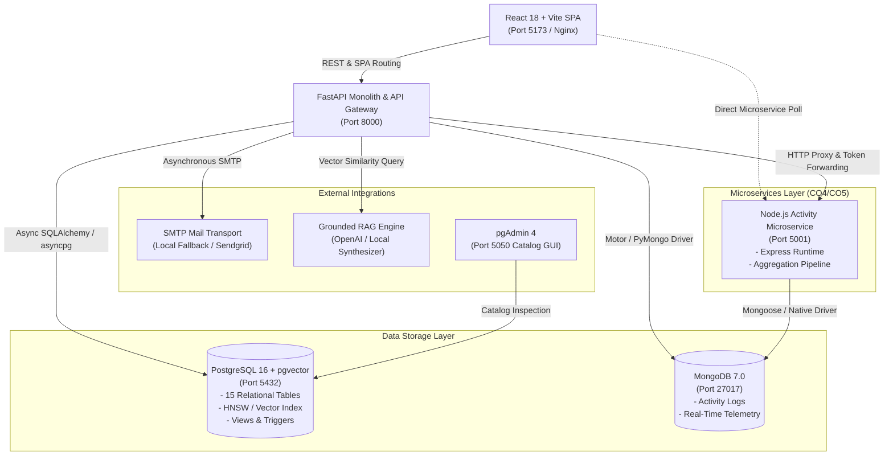
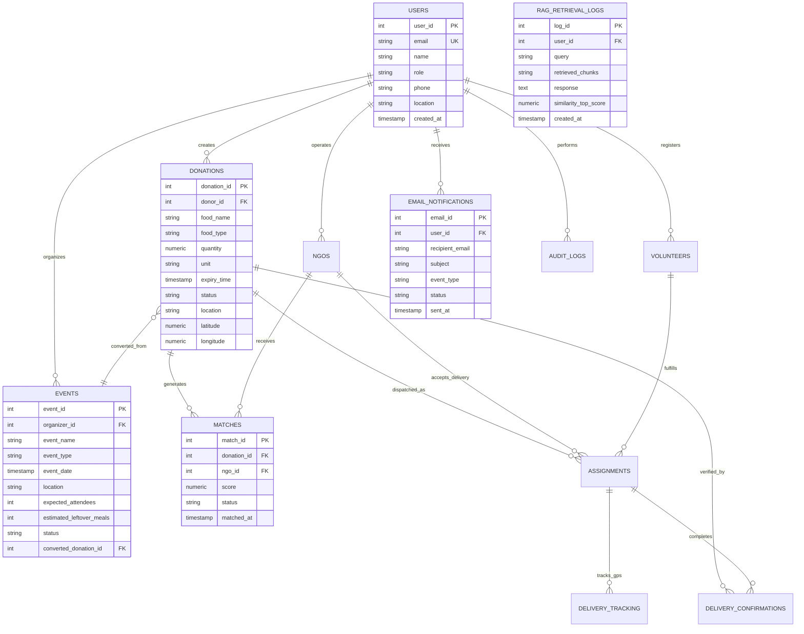
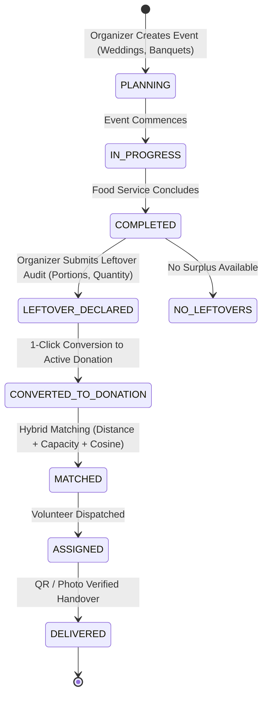

# MealBridge AI — Food Donation & Redistribution Platform

> **Intelligent, Multi-Framework DBMS Platform Connecting Donors, Verified NGOs, and Volunteer Networks with Grounded RAG, pgvector Semantic Retrieval, Event Surplus Management, and Real-Time Telemetry.**

---

## 🌟 Executive Summary

**MealBridge AI** is an enterprise-grade food redistribution platform engineered to minimize urban food waste and combat hunger. The platform pairs a high-performance **FastAPI core backend** and **PostgreSQL (with pgvector)** with a polyglot architecture featuring **Node.js/Express**, **MongoDB document storage**, and a modern **React 18** client.

MealBridge delivers 5 key capabilities requested for practical surplus redistribution:
1. **Semantic Search with `pgvector`**: 384-dimensional cosine similarity matching food items, dietary requirements, and urgent requests beyond strict keyword constraints.
2. **Grounded RAG (Retrieval-Augmented Generation)**: Domain-tuned AI chat engine grounded strictly in live PostgreSQL records with source citations and zero hallucination.
3. **Hardened OTP & Rate Limiting**: Secure sliding-window rate limiting protecting login and OTP generation, supporting cooldowns and brute-force prevention.
4. **Decoupled Email Communication Service**: Non-blocking email notifications across donation creation, NGO match notifications, delivery assignments, and OTPs.
5. **Event-Based Surplus Redistribution**: End-to-end lifecycle management for weddings, banquets, and festivals with 1-click conversion from surplus meals to matched donations.

---

## 🏗️ System Architecture



---

## 🗄️ Relational Entity-Relationship Model (CO1)



---

## 🔄 Event-Based Surplus Redistribution Lifecycle



---

## 🌐 Port & Service Inventory

| Service | Port | Technology | Purpose |
|---|---|---|---|
| **Frontend Web App** | `5173` | React 18, Vite, Tailwind CSS | Donor, NGO, Volunteer, and Event Management UI |
| **FastAPI Backend** | `8000` | FastAPI, Pydantic v2, Python 3.12 | REST APIs, Matching, Auth, RAG, Semantic Search |
| **API Documentation** | `8000/docs` | Swagger UI / OpenAPI 3.1 | Interactive endpoint testing and contract verification |
| **PostgreSQL Database** | `5432` | PostgreSQL 16 + pgvector | Primary ACID datastore, HNSW vector search, Views, Triggers |
| **MongoDB Database** | `27017` | MongoDB 7.0 | NoSQL document storage, telemetry, activity logs |
| **Activity Microservice**| `5001` | Node.js, Express, Mongoose | Independent activity tracking, analytics aggregation |
| **pgAdmin 4** | `5050` | pgAdmin Web Client | Database schema inspection, SQL runner, catalog tools |
| **Prometheus Metrics** | `8000/metrics`| Prometheus Text Format | Real-time observability and latency metrics |

---

## 🚀 Quickstart Guide

### Option 1: One-Click Docker Compose (Recommended)

Ensure Docker and Docker Compose are installed and running:

```bash
# 1. Clone or navigate to the project directory
cd /path/to/MealBridge/project

# 2. Copy the environment configuration
cp .env.example .env

# 3. Build and launch all 6 services
docker compose up --build
```

Access the platform:
- **Frontend App**: [http://localhost:5173](http://localhost:5173)
- **API Documentation**: [http://localhost:8000/docs](http://localhost:8000/docs)
- **pgAdmin**: [http://localhost:5050](http://localhost:5050) (User: `admin@mealbridge.org`, Pass: `admin123`)

---

### Option 2: Local Manual Setup

#### Prerequisites
- Node.js >= 18
- Python >= 3.11
- PostgreSQL 16+ (with `pgvector` extension)
- MongoDB 6+

#### 1. Database Initialization
```bash
# Seed restored PostgreSQL database (baseline + syllabus migrations)
psql -U postgres -d MealBridge_food_donation -f database/init.sql
```

#### 2. Backend Monolith (FastAPI)
```bash
cd backend
python -m venv .venv
source .venv/bin/activate   # On Windows: .venv\Scripts\activate
pip install -r requirements.txt
uvicorn app.main:app --reload --port 8000
```

#### 3. Activity Microservice (Node.js)
```bash
cd microservices/activity-service
npm install
npm start
```

#### 4. Frontend Client (React)
```bash
# In the project root:
npm install
npm run dev
```

---

## 🔬 Syllabus Requirements Mapping (CO1 – CO6)

| Syllabus Course Outcome | Feature Implementation | Verified Code Location |
|---|---|---|
| **CO1: Relational Database Engineering** | 15 Normalized Tables, Sequences, Constraints, Multi-table JOINs, CTEs, Window Functions (`DENSE_RANK()`, `ROW_NUMBER()`), Database Views (`v_available_donations`, `v_ngo_capacity_summary`), Audit Trigger (`trg_donation_status_audit`). | `database/init.sql`<br>`backend/app/routers/analytics_sql.py` |
| **CO2: Database Engineering & Vector Search** | Dual Polyglot Persistence (PostgreSQL relational + MongoDB documents), 384-dimensional dense vectors (`vector(384)`), Cosine Similarity matching, HNSW indexing support, Grounded RAG pipeline with live database citations. | `backend/app/services/embedding_service.py`<br>`backend/app/services/rag_service.py`<br>`database/migrations/001_syllabus_features.sql` |
| **CO3: Backend API Engineering** | Layered Architecture (Routers, Services, Repositories, Models, Schemas), JWT Authentication, RBAC (DONOR, NGO, VOLUNTEER, ADMIN), Argon2/pwdlib password hashing, Sliding-window rate limiting. | `backend/app/routers/`<br>`backend/app/core/security.py`<br>`backend/app/core/rate_limiter.py` |
| **CO4: Multi-Framework Backend Engineering** | Node.js Express microservice, MongoDB document queries, aggregation pipeline (`$group`, `$sort`), decoupled service boundaries. | `microservices/activity-service/server.js`<br>`microservices/activity-service/package.json` |
| **CO5: Microservices Engineering** | Database-per-service pattern, FastAPI API Gateway routing with token forwarding (`Authorization` header pass-through), centralized error handling, resilient circuit breaker fallback. | `backend/app/routers/activities.py`<br>`microservices/activity-service/` |
| **CO6: Deployment, Observability & Delivery** | Multi-container Docker Compose, multi-stage frontend Dockerfile, Nginx reverse proxy, Prometheus `/metrics` endpoint, `/health` readiness probes. | `docker-compose.yml`<br>`backend/Dockerfile`<br>`Dockerfile.frontend`<br>`backend/app/routers/health.py` |

---

## 🎯 5 Key Features: API Documentation & Verification

### 1. Semantic Search with pgvector (`/api/search/semantic`)
Retrieves surplus food and verified NGOs based on natural language meaning rather than exact keywords.

```bash
curl -X GET "http://localhost:8000/api/search/semantic?query=vegetarian+meals+suitable+for+children&entity_type=ALL&limit=5"
```
**Sample Response:**
```json
{
  "query": "vegetarian meals suitable for children",
  "total_results": 2,
  "execution_time_ms": 12.4,
  "results": [
    {
      "id": 1,
      "entity_type": "DONATION",
      "title": "Cooked Rice & Dal",
      "food_or_requirement": "Cooked Food",
      "quantity_or_capacity": "50 KG",
      "similarity_score": 0.8842,
      "relevance_explanation": "Vector cosine match (88.4%) against query 'vegetarian meals suitable for children'"
    }
  ]
}
```

### 2. Grounded RAG Assistant (`/api/rag/query`)
Answers user queries with strictly grounded data retrieved from live MealBridge records, preventing hallucinations.

```bash
curl -X POST "http://localhost:8000/api/rag/query" \
  -H "Content-Type: application/json" \
  -d '{
    "question": "Which food donations are suitable for an NGO that needs food for 40 children?",
    "top_k": 3
  }'
```
**Sample Response:**
```json
{
  "question": "Which food donations are suitable for an NGO that needs food for 40 children?",
  "answer": "Based on the currently available records in the MealBridge AI database, Donation #1 (Cooked Rice, 50 KG) is located in Hyderabad and expiring in 4 hours, making it directly suitable for distribution to 40 children at Helping Hands NGO.",
  "grounded": true,
  "retrieval_count": 2,
  "sources": [
    {
      "source_type": "DONATION",
      "title": "Donation #1: Cooked Rice",
      "content_snippet": "50.00 KG of Cooked Food in Hyderabad. Expires: 2026-10-06 22:00:00",
      "similarity": 0.8715
    }
  ]
}
```

### 3. Rate-Limited OTP Verification (`/api/auth/otp/send`)
Protects against brute force and automated spam using an in-memory sliding-window rate limiter (max 5 requests per 60s).

```bash
curl -X POST "http://localhost:8000/api/auth/otp/send" \
  -H "Content-Type: application/json" \
  -d '{"email": "donor@example.com", "purpose": "LOGIN"}'
```

### 4. Decoupled Email Notifications
Triggered automatically during:
- Donation registration (`DONATION_CREATED`)
- AI matching (`NGO_MATCH`)
- Volunteer dispatch (`DELIVERY_ASSIGNED`)
- One-time passwords (`OTP_VERIFICATION`)

Persistent audit records are stored in PostgreSQL table `email_notifications`.

### 5. Event Surplus Redistribution (`/api/events`)
Pre-registers large events, records surplus food audits, and converts leftovers directly into verified donations with 1 click.

```bash
# 1. Create Event
curl -X POST "http://localhost:8000/api/events" \
  -H "Authorization: Bearer <TOKEN>" \
  -H "Content-Type: application/json" \
  -d '{
    "event_name": "Sharma Wedding Reception",
    "event_type": "WEDDING",
    "event_date": "2026-10-10T19:00:00Z",
    "location": "Banjara Hills, Hyderabad",
    "latitude": 17.4165,
    "longitude": 78.4482,
    "expected_attendees": 400,
    "food_type": "VEGETARIAN",
    "estimated_leftover_meals": 60
  }'

# 2. Declare Leftovers
curl -X POST "http://localhost:8000/api/events/1/declare-leftovers" \
  -H "Authorization: Bearer <TOKEN>" \
  -H "Content-Type: application/json" \
  -d '{
    "estimated_leftover_meals": 85,
    "food_type": "Cooked Food & Sweets",
    "notes": "Packed in thermal containers."
  }'

# 3. 1-Click Convert to Donation
curl -X POST "http://localhost:8000/api/events/1/convert-to-donation" \
  -H "Authorization: Bearer <TOKEN>" \
  -H "Content-Type: application/json" \
  -d '{"expiry_hours": 6}'
```

---

## 🧪 Automated Test Suite

MealBridge maintains a comprehensive automated testing pipeline:

```bash
# Run complete test suite (21 unit tests across all syllabus features)
PYTHONPATH=backend pytest backend/tests/

# Run schema regression suite (all 12 baseline models verified)
for f in backend/test_*_schema.py backend/test_jwt.py backend/test_security.py; do
    PYTHONPATH=backend python "$f"
done

# Run Node.js microservice test suite
node microservices/activity-service/test.js
```

---

## 📧 Real-Time Email Setup & Verification

MealBridge includes an enterprise SMTP email verification engine with cryptographic single-use token lifecycle management, 30-minute expiration, and rate-limited resend protection.

### Step-by-Step Setup Guide:

1. **Create/Select an SMTP Provider**: Use Gmail SMTP, Outlook, SendGrid, Brevo, or Mailgun.
2. **Configure `.env`**: Set the following variables in your environment:
   ```env
   SMTP_HOST=smtp.gmail.com
   SMTP_PORT=587
   SMTP_USERNAME=your-email@gmail.com
   SMTP_PASSWORD=your-16-char-app-password
   SMTP_FROM_EMAIL=your-email@gmail.com
   SMTP_FROM_NAME=MealBridge
   FRONTEND_URL=http://localhost:5173
   ```
3. **Gmail App Password (Crucial)**:
   - For Gmail, generate a **Google App Password** (Google Account -> Security -> 2-Step Verification -> App Passwords).
   - Generate an App Password specifically for "MealBridge".
4. **Security Notice**: **Do NOT use your normal Gmail account password**. Normal Gmail passwords will be rejected by Google's SMTP servers.
5. **Start Docker Services**:
   ```bash
   docker compose up -d
   ```
6. **Open MealBridge**:
   - Web Client: [http://localhost:5173](http://localhost:5173)
   - API Docs: [http://localhost:8000/docs](http://localhost:8000/docs)
7. **Register/Login as NGO**:
   - Navigate to `/login` or `/select-role`, sign in as an NGO organization (e.g., `priya@helpinghands.in` or create a new NGO).
8. **Enter a Real Organization Email**:
   - Go to `/ngo/profile` (Organization Profile).
   - Enter your real organization email address in the Organization Email input field.
9. **Click "Send Verification Email"**:
   - MealBridge generates a cryptographically secure token and delivers an HTML verification link to the recipient inbox via STARTTLS.
10. **Open Real Inbox**:
    - Locate the verification email with subject `Verify your MealBridge NGO Email`.
11. **Click "Verify Email"**:
    - The verification link directs to `http://localhost:5173/verify-email?token=<TOKEN>`.
    - MealBridge validates the token, activates single-use consumption, and transitions status to verified.
12. **Confirm Dashboard Shows "Email Verified"**:
    - Organization Profile dynamically displays the `✓ Email Verified` badge.
    - Verified NGOs now qualify for real-time donation match email alerts!

---

## 🐳 Docker Run Commands

```bash
# Build and start all services in background
docker compose up -d --build

# View running services status
docker compose ps

# Inspect backend logs in real-time
docker compose logs -f mealbridge-backend

# Restart backend service after code or env changes
docker compose restart mealbridge-backend

# Stop all services without deleting data
docker compose down
```

---

## 📄 License & Academic Attribution
Developed as part of the Database Management Systems & Advanced Backend Engineering curriculum. All rights reserved.